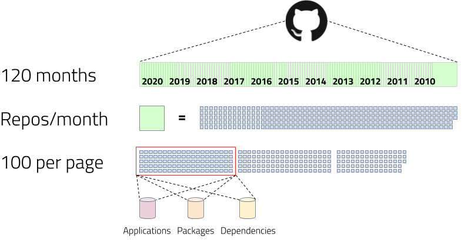
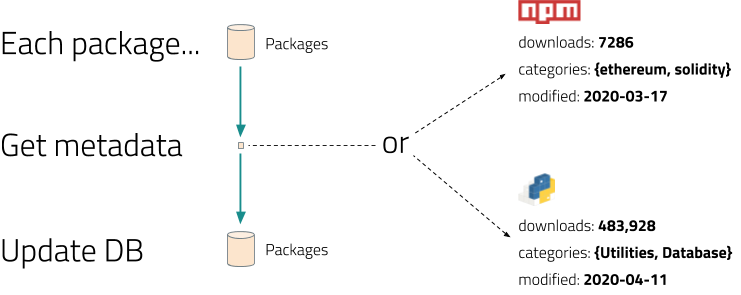
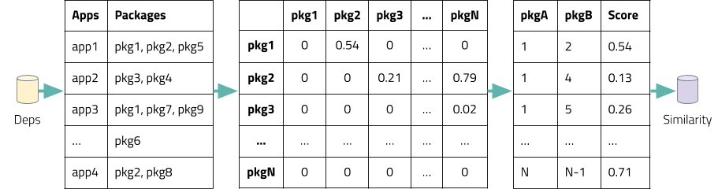

# Pipeline

The machine learning pipeline takes a three phase approach: 1) querying GitHub for all repositories containing a package.json (npm) or requirements.txt (PyPI) manifest file with dependencies, 2) querying npmjs.com and pypi.org for package metadata related to those dependencies, and finally 3) training the cosine similarity model.

First, the pipeline builds its training set by querying all repositories in GitHub for those containing a npm or PyPI manifest file with dependencies (packages). Because the GitHub GraphQL API only allows up to 1,000 repositories to be fetched in a single search query, we fetch repositories based on their created date, one day at a time. To be fetched, a repository must have more than 1 star and be classified as a JavaScript or Python repository by GitHub. We include the star criteria to filter out repositories that aren’t popular and are probably of low quality. Once fetched, a repository must have a package.json or requirements.txt file in its root folder to be included in our training dataset.

The repository and package name (including version) are persisted to the applications and packages tables in the database. We differentiate between major versions of a package, but not minor or patch versions. To make it easier to process the data, we generate an integer id for each application and package, respectively. These application and package ids are unique to their respective tables. We then store the mapping from application to package, referencing these ids as foreign keys in the dependencies table. We avoid duplicates by using PostgreSQL INSERT ON CONFLICT statements to perform upserts. If the data doesn’t already exist, it is inserted, otherwise it is updated.

Second, the machine learning pipeline goes through all packages stored in the database, and retrieves the metadata from npmjs.com and pypi.org for each. This metadata includes the categories, the date each package was last modified, and download counts for last month and the same month a year prior. Categories in particular are arrays of strings that are optionally associated with each package, and provide the package author with a means of tagging the purpose of a package. Download counts are used to calculate the absolute trend and relative trend component scores, while the categories and package modified date are used solely to provide the user with additional filtering, sorting, and search options.

Third, the machine learning pipeline determines the similarity of all packages in the corpus. It retrieves all records from the dependencies table, and creates a vectorized matrix of the application to package mapping using sparse vectors. Next, it computes the package cosine similarity of all columns in the matrix, which results in a package similarity matrix where each cell is a value between 0 and 1 inclusive, representing the degree to which two packages tend to appear in the same package.json or requirements.txt files together. We iterate through all cells in the matrix, ignore cells with a zero score to save space, and write the rest to our similarity table, which is then used by the web server to generate recommendations. The similarity table has three columns, the package_a and package_b columns are the packages with a non-zero similarity score, and the similarity column contains the score.

