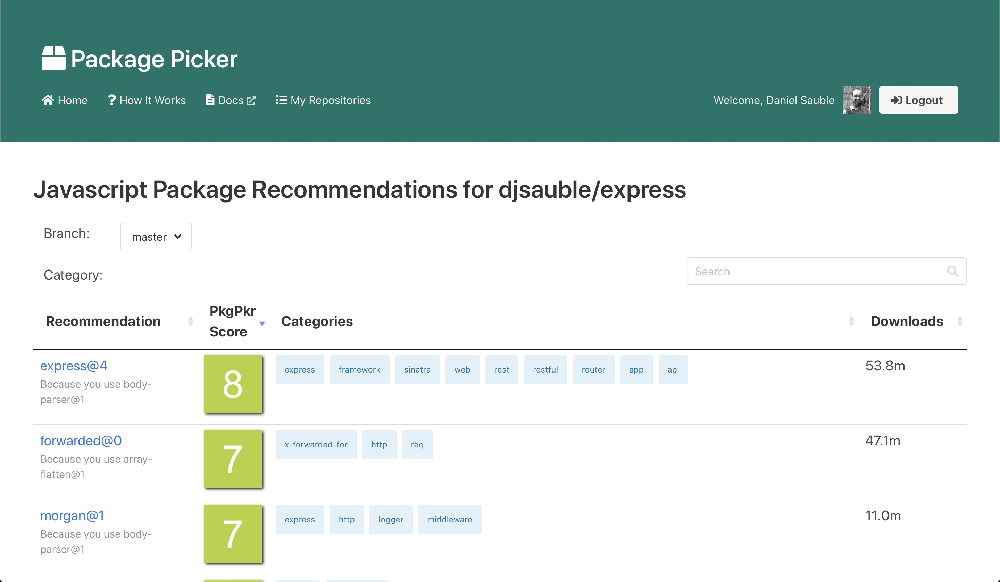
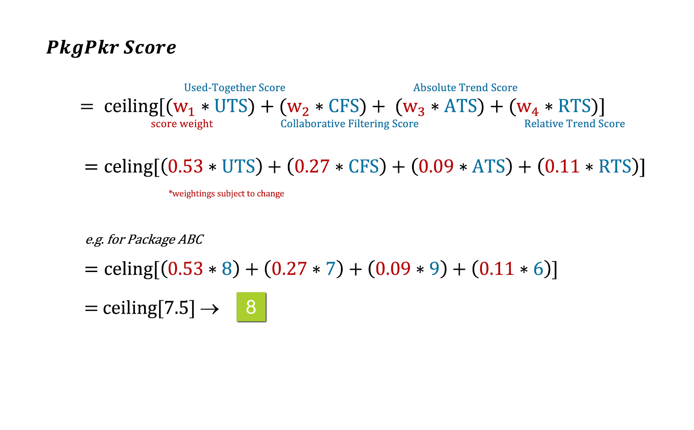

# Web Server

To retrieve recommendations, a user can either use our API, input dependencies manually, or log in to GitHub and retrieve a list of their repositories with a package.json or requirements.txt file. When they select one of these repositories, we fetch up to 10,000 packages that have the highest similarity scores relative to the packages in the user’s repository.

We refrain from returning packages that already exist in the user’s repository. For each recommendation, we calculate its PkgPkr Score, which is the weighted sum of 1) its similarity score, 2) popularity in terms of how many other distinct packages appear together with it, 3) absolute growth in terms of year-over-year downloads, and 4) percentage growth in terms of year-over-year downloads. We log transform the popularity and download counts prior to computation of the scores because the data distribution is highly skewed.  The resulting score is an integer between 1 and 10, inclusive, where 10 indicates a very strong recommendation.  The web server has filtering and sorting capabilities which allow the user to browse these recommendations and their associated metadata, including the computed PkgPkr score.

